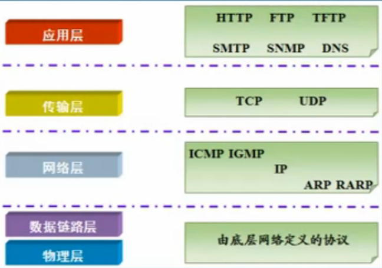

# HTTP1.1规定

协议就是数据封装格式+传输

## OSI七层模型

 - 应用层(Application) 提供网络与用户应用软件之间的接口服务
 - 表示层(Presentation) 提供格式化的表示和转换数据服务，如加密和压缩
 - 会话层(Session) 提供包括访问验证和会话管理在内的建立和维护应用之间通信的机制
 - 传输层(Transimission) 提供建立、维护和取消传输连接功能，负责可靠地传输数据(PC)
 - 网络层(Network) 处理网络间路由，确保数据及时传送(路由器)
 - 数据链路层(DataLink) 负责无错传输数据，确认帧、发错重传等(交换机)
 - 物理层(Physics) 提供机械、电气、功能和过程特性(网卡、网线、双绞线、同轴电缆、中继器)

#### TCP/IP参考模型

后来在使用过程中，借鉴OSI七层参考模型，将网络接口层划分为了物理层和数据链路层，形成五层结构




#### 2.1扩充的BNF表达式(巴科斯-诺尔范式)

 - `规则 1 | 规则 2 `
    - 由竖线`|`分开的元素是可选的，例如，“yes | no”表示 yes 或 no 都是可接受的。 

 - `(规则 1 规则 2)`
    - 围在括号里的多个元素视作一个元素。所以， `“(elem (foo | bar) elem)”`符合的字符串是`“elem foo elem”`和`“elem bar elem”`。

 - `*规则`
    - 前面的字符`“*”`表示重复。完整的形式是`“<n>*<m>元素”`，表示元素至少出现`<n>`次，至多出现`<m>`次。默认值是 0 和无穷大，所以`"*（元素）"`允许任何数值，包括零；`"1*元素"`至少出现一次；`"1*2element"`允许出现一次或两次。

 - `[规则]`
    - 方括号里是任选元素；`“[foo bar]”`相当于`“*1（foo bar”`

 - `N规则`
    - 特殊的重复：`“<n>（元素”`与`“<n>*<n>（元素”`等价；就是说，（元素）正好出现`<n>`次。这样 `2DIGIT `是一个两位数字，`3ALPHA`是一个由三个字符组成的字符串。

 - `#规则`
    - 类似于`“*”`

 - 注释（comment）


## 3.协议参数

#### 3.1HTTP版本


HTTP 使用一个`“<major>.<minor>”`数字模式来指明协议的版本号。

应用程序的 HTTP 版本是应用程序最少条件遵循的最高 HTTP 版本

###### 3.2.2 HTTP URL 

 `http_URL = "http:" "//" host [ ":" port ] [ abs_path [ "?" query ]]`

###### 3.2.3 URL比较

特殊情况

 - 一个为空或未给定的端口等同于默认端口号
 - scheme的比较是不区分大小写的
 - 空的abs_path等同于"/"


#### 3.4 字符集


#### 3.5 内容编码 Content Codings

所有内容编码（content-coding）的值是不区分大小写的

HTTP/1.1 在Request Headers （AcceptEncoding，14.3 节）和Response Headers（Content-Encoding）头域里使用内容编码
（content-coding）的值


 - gzip
 - compress
 - deflate(缩小)
 - identity(一致性),不进行任何编码转换,仅用于Accept-Encoding,不用于Content-Encoding


 #### 3.6传输编码 Transfer Codings

区别于内容编码Content Codings,传输编码是消息的属性,而不是实体内容的属性

`transfer-coding = "chunked" | transfer-extension `

###### 块传输编码（Chunked Transfer Coding） 


#### 3.7媒体类型 Media Type

HTTP 在 Content-Type实体头域和 Accept 请求头域里利用了类型。

`Content-Type: text/html`
`media-type = type "/" subtype *（ ";" parameter ）`


#### 3.8产品标记

产品标记用于使通信应用软件能通过软件名称和版本来标识自己。很多头域都会利用产品标记，
这些头域允许构成应用程序重要部分的子产品能以空白分隔去列举。通常为了识别应用程序，
产品以应用程序的重要性的顺序来列举的。

`User-Agent: Mozilla/5.0 (Macintosh; Intel Mac OS X 10_15_5) AppleWebKit/537.36 (KHTML, like Gecko) Chrome/84.0.4147.125 Safari/537.36`

`Server: nginx`

#### 3.10 语言标签

HTTP 在 Accept-Language 和 Content-Language 头域里应用
到语言标签（language tag）

`Accept-Language: zh-CN,zh;q=0.9,en;q=0.8`


#### 3.11 实体标签

HTTP/1.1 在 ETag，Ifmatch，If-None-match（和 If-Rang（头域中运用实体标签。


## HTTP消息

#### 4.1消息类型

#### 4.2消息头

#### 4.3 消息主体


## 请求 Request


```
Request = Request-Line ; Section 5.1
*（
（ general-header ; Section 4.5| request-header ; Section 5.3| entity-header ） 
CRLF） ; Section 7.1
CRLF
[ message-body ] ; Section 4.3
```

一个请求消息是从客户端到服务器端的，在消息首行里包含方法，资源指示符，协议版本。


#### 5.1请求行

`Request-Line =Method SP Request-URL SP HTTP-Version CRLF `

`GET /api/fti/ad/list/01 HTTP/1.1`

###### 5.1.1 方法

大小写敏感

如果服务器能理解某方法但此方法,对请求资源不被允许的，那么源服务器应该返回 405 状态码（方法不允许）；
如果源服务器不能识别或没有实现某个方法，那么服务器应返回 501 状态码（没有实现）。
方法 GET 和 HEAD必须被所有一般的服务器支持。所有其它的方法是可选的；


#### 5.3请求头域

```
请求头（request-header） = Accept ;14.1 节
                        | Accept-Charset ;14.2 节
                        |Accept-Encoding ;14.3 节
                        |Accept-Language ;14.4 节
                        |Authorization ;14.8 节
                        |Expect ;14.20 节
                        |From ;14.22 节
                        |Host ;14.23 节
                        |If-Match ;14.24 节
                        |If-Modified-Since ;14.25 节
                        | If-None-Match ;14.26 节
                        | If-Range ;14.27 节
                        | If-Unmodified-Since ;14.28 节
                        | Max-Forwards ;14.31 节
                        | Proxy-Authorization ;14.34 节
                        | Range ;14.35 节
                        | Referer ;14.36 节
                        |TE ;14.39 节
                        |User-Agent ;14.43 节

```


## 6.响应

#### 6.1状态行

`Status-Line = HTTP-Version SP Status-Code SP Reason-Phrase CRLF `
            

`HTTP/1.1 200`

###### 6.1.1 状态码和原因短语

第一位数字有五种值： 

```
-1xx ：报告的 -请求被接收到，继续处理
-2xx ：成功 - 被成功地接收（received），理解（understood），接受
（accepted）的动作 。
-3xx ：重发 - 为了完成请求必须采取进一步的动作。
-4xx ：客户端出错 - 请求包括错的语法或不能被满足。
-5xx ：服务器出错 - 服务器无法完成显然有效的请求。
```


#### 6.2响应头域


```
response-header = Accept-Ranges ; 14.5 节
                |Age ; 14.6 节
                |Etag ; 14.19 节
                |Location ; 14.30 节
                |Proxy-Autenticate ; 14.33 节
                |Retry-After ; 14.37 节
                |Server ; 14.38 节
                |Vary ; 14.44 节
                |WWW-Authenticate ; 14.47 节
 ```

 ## 7.实体（Entity） 

实体包括实体头域（entity-header）与实体主体（entity-body），而有些响应只包括实体头域（entity-header）。

#### 7.1 实体头域

```
entity-header = Allow ; Section 14.7
                | Content-Encoding ; Section 14.11
                | Content-Language ; Section 14.12
                | Content-Length ; Section 14.13
                | Content-Location ; Section 14.14
                | Content-MD5 ; Section 14.15
                | Content-Range ; Section 14.16
                | Content-Type ; Section 14.17
                | Expires ; Section 14.21
                | Last-Modified ; Section 14.29
                | extension-header
```

#### 实体主体（Entity Body）

实体主体（entitybody）从消息主体根据传输译码头域（Transfer-Encoding）解码得到，传输译码用于确保消
息的安全和合适传输。


`Entity-body：=Content-Encoding（ Content-Type（ data） ） `


## 连接


## 9.方法定义

#### 9.3GET

```
如果请求消息包含 If-Modified-Since,，If-Unmodified-Since，If-Match，If-None-Match 或者
If-Range 头域，GET 的语义将变成“条件GET”。一个条件 GET 方法会请求满足条件头域的实体。条件 GET 方法的目的是为了减少不必要的网络使用，
这通过允许利用缓存里仍然保鲜的实体而不用多次请求或传输客户端已经拥有的实体来实现的。.
```

#### 9.4HEAD

HEAD 方法和 GET 方法一致，除了服务器不能在响应里返回消息主体。HEAD 请求响应里
HTTP 头域里的元信息（译注：元信息就是头域信息）应该和 GET 请求响应里的元信息一致。
此方法被用来获取请求实体的元信息而不需要传输实体主体（entity-body）。此方法经常被用
来测试超文本链接的有效性，可访问性，和最近的改变。

#### 9.5POST

POST 方法的响应是不可缓存的。除非响应里有合适的 Cache-Control 或者 Expires 头域。

#### 9.6PUT

除非特别指出，PUT 方法请求里的实体头域应该被用于资源的创建或修改


