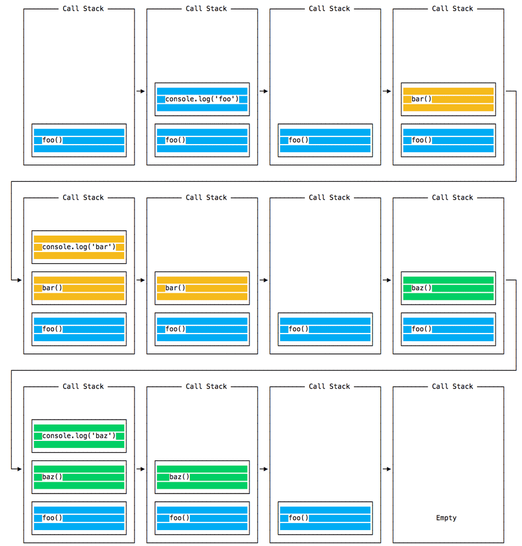
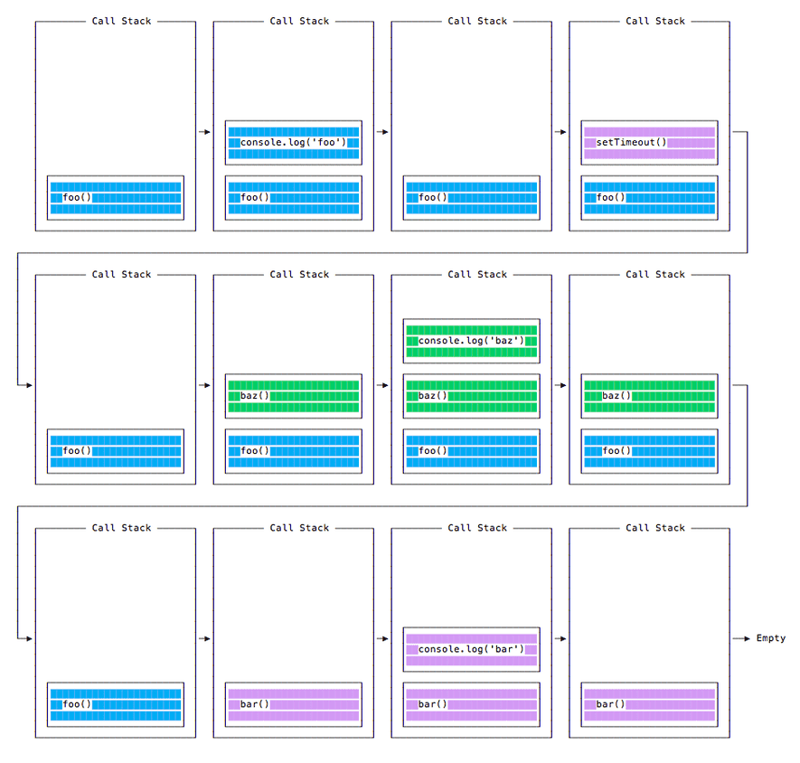
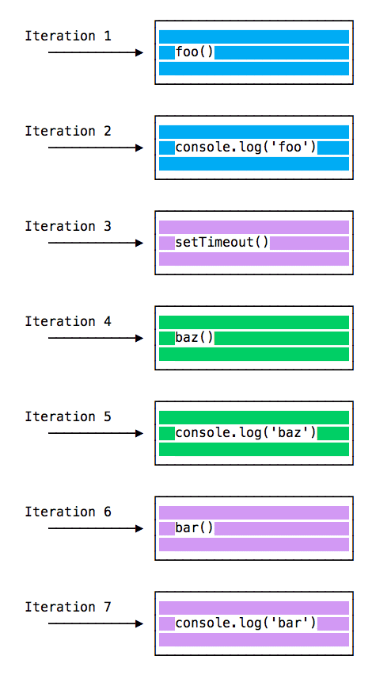

# Node.js 事件循环

## 介绍

 Node.js 如何做到异步且具有非阻塞的 I/O


## 阻塞事件循环

任何花费太长时间才能将控制权返回给事件循环的 JavaScript 代码，都会阻塞页面中任何 JavaScript 代码的执行，甚至阻塞 UI 线程，并且用户无法单击浏览、滚动页面等。


JavaScript 中几乎所有的 I/O 基元都是非阻塞的。 网络请求、文件系统操作等。 被阻塞是个异常，这就是 JavaScript 如此之多基于回调（最近越来越多基于 promise 和 async/await）的原因。


## 调用堆栈

调用堆栈是一个 LIFO 栈（后进先出）。

事件循环不断地检查调用堆栈，以查看是否需要运行任何函数。
当执行时，它会将找到的所有函数调用添加到调用堆栈中，并按顺序执行每个函数。


## 一个简单的事件循环的阐释


```js
const bar = () => console.log('bar')

const baz = () => console.log('baz')

const foo = () => {
  console.log('foo')
  bar()
  baz()
}

foo()
```

打印结果
```
foo
bar
baz
```

当运行此代码时，会首先调用 foo()。 在 foo() 内部，会首先调用 bar()，然后调用 baz()



每次迭代中的事件循环都会查看调用堆栈中是否有东西并执行它直到调用堆栈为空：


## 入队函数执行(macro（宏任务）队列)

上面的示例看起来很正常，没有什么特别的：JavaScript 查找要执行的东西，并按顺序运行它们。

让我们看看如何将函数推迟直到堆栈被清空。

`setTimeout(() => {}, 0)` 的用例是调用一个函数，但是是在代码中的每个其他函数已被执行之后。

举个例子：

```js
const bar = () => console.log('bar')

const baz = () => console.log('baz')

const foo = () => {
  console.log('foo')
  setTimeout(bar, 0)
  baz()
}

foo()
```

该代码会打印：

```
foo
baz
bar
```

当运行此代码时，会首先调用 foo()。 在 foo() 内部，会首先调用 setTimeout，将 bar 作为参数传入，并传入 0 作为定时器指示它尽快运行。 然后调用 baz()。

此时，调用堆栈如下所示：



这是程序中所有函数的执行顺序：



常见的 macro-task 比如：setTimeout、setInterval、 setImmediate、script（整体代码）、 I/O 操作、UI 渲染等。


## 消息队列

当调用 `setTimeout()` 时，浏览器或 Node.js 会启动定时器。 当定时器到期时（在此示例中会立即到期，因为将超时值设为 0），则回调函数会被放入“消息队列”中。

在消息队列中，用户触发的事件（如单击或键盘事件、或获取响应）也会在此排队，然后代码才有机会对其作出反应。 类似 `onLoad` 这样的 `DOM` 事件也如此。

事件循环会赋予调用堆栈优先级，它首先处理在调用堆栈中找到的所有东西，一旦其中没有任何东西，便开始处理消息队列中的东西。

我们不必等待诸如 `setTimeout`、`fetch`、或其他的函数来完成它们自身的工作，因为它们是由浏览器提供的，并且位于它们自身的线程中。 例如，如果将 `setTimeout` 的超时设置为 `2` 秒，但不必等待 `2` 秒，等待发生在其他地方。


## ES6 作业队列(micro-task微任务)

ECMAScript 2015 引入了作业队列的概念，Promise 使用了该队列（也在 ES6/ES2015 中引入）。 这种方式会尽快地执行异步函数的结果，而不是放在调用堆栈的末尾。


在当前函数结束之前 resolve 的 Promise 会在当前函数之后被立即执行。

有个游乐园中过山车的比喻很好：消息队列将你排在队列的后面（在所有其他人的后面），你不得不等待你的回合，而工作队列则是快速通道票，这样你就可以在完成上一次乘车后立即乘坐另一趟车。


示例：

```js
const bar = () => console.log('bar')

const baz = () => console.log('baz')

const foo = () => {
  console.log('foo')
  setTimeout(bar, 0)
  new Promise((resolve, reject) =>
    resolve('应该在 baz 之后、bar 之前')
  ).then(resolve => console.log(resolve))
  baz()
}

foo()
```

这会打印：

```
foo
baz
应该在 baz 之后、bar 之前
bar
```

这是 Promise（以及基于 promise 构建的 async/await）与通过 setTimeout() 或其他平台 API 的普通的旧异步函数之间的巨大区别。


#### 总结，浏览器和 Node 环境下，microtask 任务队列的执行时机不同

Node 端，microtask 在事件循环的各个阶段之间执行
浏览器端，microtask 在事件循环的 macrotask 执行完之后执行